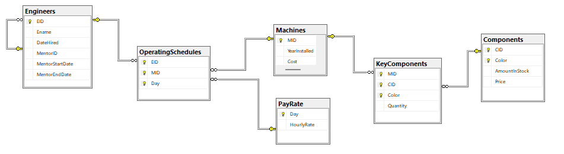
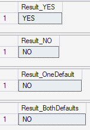
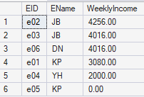
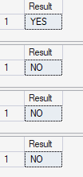
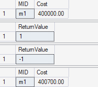
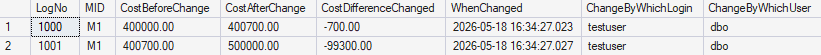

# Factory-Database
Relational database system for managing engineer schedules, machine operations, and payroll calculations. Includes user-defined functions, stored procedures, triggers, and a security controls GUI built in Python.

## Database Schema

Six related tables covering engineers, machines, components,
operating schedules, and pay rates.

## udf1 — Engineer Schedule Validation

Checks whether a specified engineer is **not** scheduled to operate 
a specified machine on Sunday, Monday, or Tuesday. Returns `YES` or `NO`.

Default values are set to machine `m1` and engineer `e01`.

### Test Cases
- `udf1('m4', 'e02')` → YES — e02 is not scheduled to operate m4 on those days
- `udf1('m1', 'e01')` → NO — e01 does operate m1 on Monday
- `udf1('m1', DEFAULT)` → NO — one default input, EID defaults to e01
- `udf1(DEFAULT, DEFAULT)` → NO — both inputs use default values

## udf2 — Engineer Weekly Income Summary

Returns a summary table of every engineer's weekly income based 
on their operating schedule and daily pay rates. Income is 
calculated as HourlyRate × 8 hours per scheduled day.

Engineers with no machines scheduled appear with an income of 
zero rather than being excluded from results.

Note: 8-hour workday assumed as no shift duration was specified 
in the schema.

### sp1 — Engineer Schedule Validation (Stored Procedure)

Performs the same schedule validation as udf1 but implemented 
as a stored procedure. Takes a machine ID and engineer ID as 
inputs with the same default values, returning 
YES or NO as a result set.

### Test Cases
- `EXEC dbo.sp1 'm4', 'e02'` → YES
- `EXEC dbo.sp1 'm1', 'e01'` → NO
- `EXEC dbo.sp1 'm1'` → NO — EID defaults to e01
- `EXEC dbo.sp1` → NO — both inputs use default values

### sp2 — Machine Cost Update with Audit Logging

The procedure enforces a 10% cost change limit, returning 1 
for successful updates and -1 for invalid updates.

Every update attempt is logged to MachineCostLog regardless 
of whether it was approved or rejected, supporting future auditing.
