# Factory-Database
Relational database system for managing engineer schedules, machine operations, and payroll calculations. Includes user-defined functions, stored procedures, triggers, security controls, and a GUI built in Python.

## Database Schema

Six related tables covering engineers, machines, components,
operating schedules, and pay rates.

## udf1 — Engineer Schedule Validation

Checks whether a specified engineer is **not** scheduled to operate 
a specified machine on Sunday, Monday, or Tuesday. Returns `YES` or `NO`.

Default values are set to machine `m1` and engineer `e01`.

### Test Cases
- `udf1('m4', 'e02')` → YES — e02 is not scheduled to operate m4 on those days
- `udf1('m1', 'e01')` → NO — e01 does operate m1 on Monday
- `udf1('m1', DEFAULT)` → NO — one default input, EID defaults to e01
- `udf1(DEFAULT, DEFAULT)` → NO — both inputs use default values

## udf2 — Engineer Weekly Income Summary

Returns a summary table of every engineer's weekly income based 
on their operating schedule and daily pay rates. Income is 
calculated as HourlyRate × 8 hours per scheduled day.

Engineers with no machines scheduled appear with an income of 
zero rather than being excluded from results.

Note: 8-hour workday assumed as no shift duration was specified 
in the schema.

### sp1 — Engineer Schedule Validation (Stored Procedure)

Performs the same schedule validation as udf1 but implemented 
as a stored procedure. Takes a machine ID and engineer ID as 
inputs with the same default values, returning 
YES or NO as a result set.

### Test Cases
- `EXEC dbo.sp1 'm4', 'e02'` → YES
- `EXEC dbo.sp1 'm1', 'e01'` → NO
- `EXEC dbo.sp1 'm1'` → NO — EID defaults to e01
- `EXEC dbo.sp1` → NO — both inputs use default values

### sp2 — Machine Cost Update with Audit Logging

The procedure enforces a 10% cost change limit, returning 1 
for successful updates and -1 for invalid updates.

Every update attempt is logged to MachineCostLog regardless 
of whether it was approved or rejected, supporting future auditing.

### trg1 — Component Color Validation

Protects the Components table by enforcing two rules:
1. No duplicate CID and color combinations are allowed
2. New colors must be either already existing in the Components 
   table or one of three approved new colors: pink, white, or yellow

**trg1** fires on INSERT and UPDATE of the Components table.

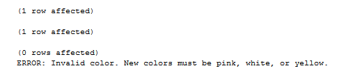

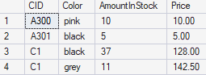

Test 1 confirms a valid new color is accepted. Test 2 
confirms an existing color is still allowed. Test 3 
confirms an invalid new color is rejected and rolled 
back with an error message.

### trg2 — Machine and Component Integrity (trg21 & trg22)

Two triggers that enforce the rule that every machine in the 
Machines table must have at least one component in KeyComponents.

**trg21** fires on INSERT and UPDATE of the Machines table. 
Prevents a new or modified machine from existing without at 
least one associated component.

**trg22** fires on DELETE and UPDATE of the KeyComponents table.
Prevents removing or modifying a component if it is the only 
one associated with its machine.

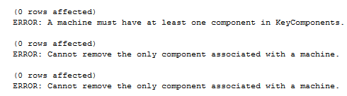

All three test cases intentionally attempt rule violations to 
confirm both triggers correctly block and roll back invalid 
operations with an appropriate error message.

### sec1 — Database User and Role Assignment

Creates a SQL Server authenticated login g1 and database user u1, 
then assigns u1 to the db_owner fixed database role making them 
a co-owner of the Factory database. All tests run inside a 
transaction that rolls back on completion leaving the database 
unchanged after verification.

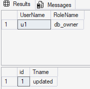

u1 is confirmed as a member of the db_owner role, granting 
full co-owner privileges over the Factory database.

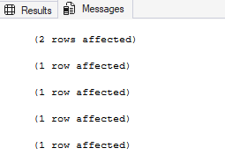

All six co-owner permission tests executed successfully as u1:
- Test 1: Created a new table
- Test 2: Inserted data
- Test 3: Updated data
- Test 4: Deleted a row
- Test 5: Dropped the table
- Test 6: Created and dropped a new user

Transaction rolled back after testing to preserve database state.

### sec2 — Restricted Database User

Creates login g2 and user u2 with limited database access.
u2 can read all tables except Engineers and PayRate, can 
access engineer income data through udf2, and is permanently 
denied all data manipulation regardless of future role changes.

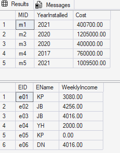

u2 successfully reads Machines and accesses udf2 for engineer
income data while being denied direct access to sensitive tables.

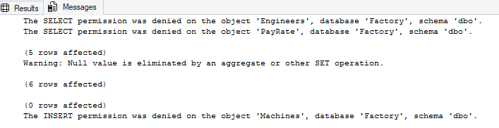

All five permission tests confirm correct access controls:
Engineers and PayRate reads denied, Machines read permitted,
udf2 accessible, and INSERT permanently blocked.

Note: The null warning on udf2 is expected behavior. SQL Server 
flags the NULL value before ISNULL converts it to zero for 
engineers with no scheduled machines. The result is handled 
correctly as shown in the output.

## GUI — Factory Security Demo

A Python tkinter application demonstrating SQL injection 
vulnerabilities and secure coding practices. Ran locally 
against the Factory database built in this project. There is a setup script for the initial connection to the SQL Database, 
as well as the users table and the creation of sp3. Then a guiinject.py with the main application login and sp3 usage.

**Built with:** Python, tkinter, pyodbc, SQL

**Files:**
- `setup.sql` — initializes the Users table, seeds login 
  credentials, and creates SP3
- `guiinject.py` — main application containing the login 
  page and SP3 dashboard

### Application Flow

**1. Login Page**
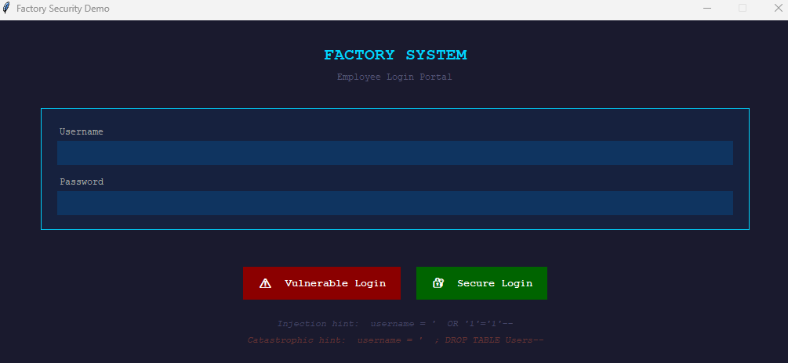

Two login paths are available: a vulnerable login using 
string concatenation and a secure login using parameterized 
queries. SQL injection hints are displayed to demonstrate 
the attack surface.

**2. SQL Injection — Catastrophic Result**
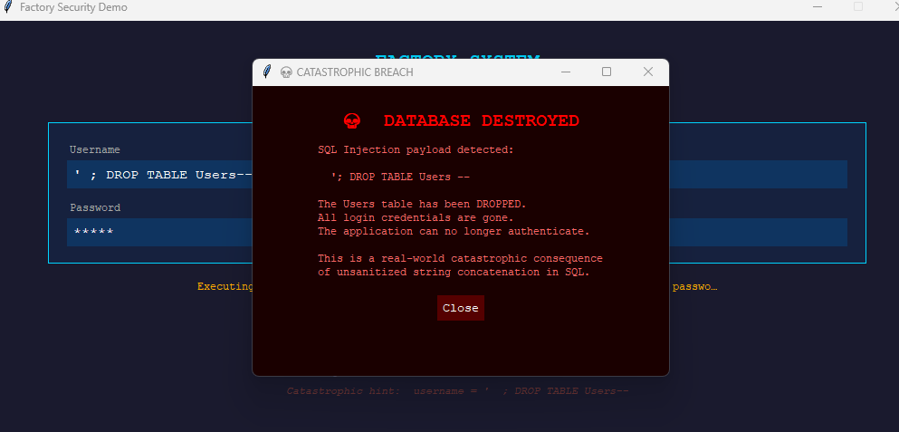

The vulnerable login accepts a DROP TABLE payload through 
string concatenation, demonstrating how unsanitized input 
can result in catastrophic data loss.

**3. Secure Login — Security Measures**

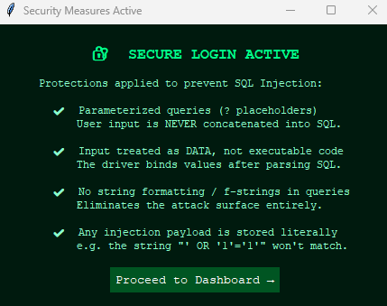

Upon successful secure login a dialog displays the security 
measures in place. A vulnerable attempt, such as ' OR '1'='1'--,
will not work since these measures are in place.

**4. Dashboard — SP3 Results**
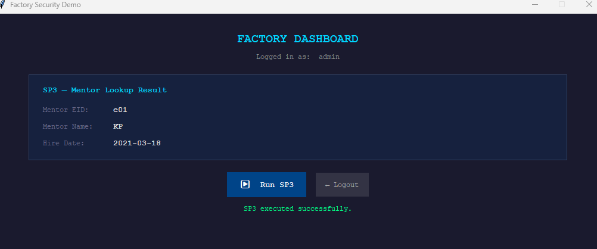

After successful authentication the dashboard executes SP3 
to display mentor information for the engineer assigned to 
the highest value machine. 
